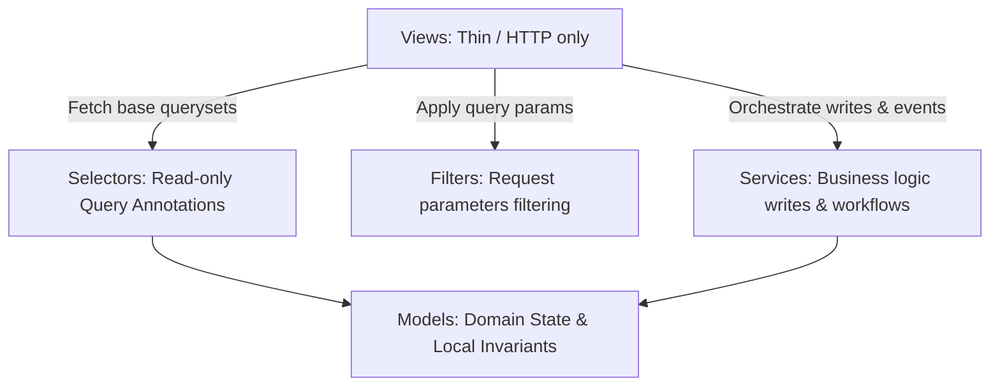
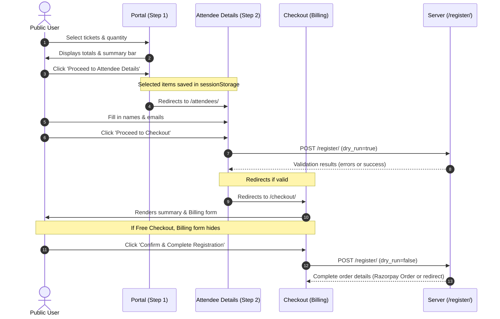

# EventHub — Project Business Logic & Architecture Description

This document details the business logic, constraints, models, workflows, and Django architecture of the EventHub event ticketing and registration application.

---

## 1. System Components & Models

### Accounts (`apps.accounts`)
- Manages authentication, user profiles, and administrative sessions.
- Staff/Admin users can access the administrative backend panel (`/panel/dashboard/` and `/panel/registrations/`).
- Public users register as guests or logged-in users.

### Tickets (`apps.tickets`)
Stores details for different entry/seat categories.
- **`ticket_type`**: `free` or `paid`.
  - *Constraint*: Free tickets must have a price of `0`. Paid tickets must have a price greater than `0`.
- **`quantity_type`**: `limited` or `unlimited`.
  - *Constraint*: Limited tickets require `total_quantity` to be specified. Unlimited tickets default `total_quantity` to `None`.
- **`duplicate_email`**: Boolean flag.
  - *Constraint*: If `True`, the same email address can register multiple times for this ticket. If `False`, email reuse is blocked.
- **`is_active`**: Boolean flag. Only active tickets are listed in the public portal.

### Registrations (`apps.registrations`)
Represents the purchase order and attendee database.
- **`Registration`**: Represents the billing contact/transaction level.
  - Contains fields: `contact_name`, `contact_email`, `contact_phone`.
  - `status`: `pending`, `processing`, `completed`, `failed`, `cancelled`.
- **`RegistrationItem`**: Represents one attendee seat under a specific ticket category.
  - Contains inline attendee details: `attendee_name`, `attendee_email`, `attendee_phone`.
  - Snapshots `unit_price` at the time of order placement to isolate historic registrations from pricing updates.

### Payments (`apps.payments`)
Handles billing integrations.
- Integrates with **Razorpay**.
- Creates a `Transaction` row pointing to a Razorpay `order_id`.
- Validates signatures client-side and server-side on callback.
- Exposes a server-to-server webhook callback to handle asynchronous capture notifications (`payment.captured` or `payment.failed`) from Razorpay.

### Activity Logs (`apps.activity`)
- Logs audit actions (e.g. `payment_created`, `payment_verified`, `registration_view`, `ticket_create`) for administrative monitoring.

---

## 2. Django Code Placement Architecture

The project adheres strictly to a **Service/Selector/Filter separation of concerns** pattern:



### A. Selectors (`selectors.py`)
Centralizes all database reads, annotations, and statistics calculations. No writes or side effects are allowed.
- **`get_active_tickets_with_counts_selector()`**: Annotates active tickets with pre-aggregated `sold_count` figures.
- **`get_all_tickets_with_counts_selector()`**: Annotates all tickets with `sold_count` for admin views.
- **`get_registration_items_selector()`**: Returns registration items pre-fetching tickets, registrations, and transactions.
- **`get_dashboard_stats_selector()`**: Aggregates dashboard KPIs (active tickets, registrations, stale registrations, total revenue).

### B. Filters (`filters.py`)
Separates request-driven filter parsing configuration from the views:
- **`TicketFilter`**: Handles query-param searches for ticket listings.
- **`RegistrationFilter`**: Handles attendee-wise registrations searching and status filtering.

### C. Services (`services.py`)
Contains business logic workflows, transactional boundaries, and database writes:
- **`create_registration(...)`**: Validates tickets, checks email conflicts, verifies quota, creates registration orders and attendee rows.

### D. Thin Views (`views.py`)
Views do not construct queries directly. They only handle HTTP parsing, invoke selectors/filters, execute services, and return responses.

---

## 3. Transaction Safety & Concurrency Control

To guarantee safe registration purchases under high-concurrency conditions (e.g. multi-user checkout for the last remaining tickets), the backend implements the following safety measures:

### A. Database Transaction Boundaries
* All database writes, checkouts, and state updates occur inside an atomic block using Django's `@db_transaction.atomic` wrapper. 
* If any validation fails, duplicate email is detected, or payment integration errors occur mid-process, the entire database transaction rolls back, preventing partial or corrupt registration data.

### B. Pessimistic Row Locking (`select_for_update()`)
* During quota validation, the database acquires write-locks on the specific `Ticket` rows in order to block other concurrent checkouts from accessing the same rows.
* This forces concurrent users to wait in a serialized queue, ensuring that ticket available counts are never read in a stale state.

### C. Deterministic Lock Ordering (Deadlock Prevention)
* To prevent database deadlocks when a user purchases multiple ticket types simultaneously (e.g. Request A locks Ticket 1 then Ticket 2, while Request B locks Ticket 2 then Ticket 1), the system extracts, deduplicates, and sorts the ticket IDs in ascending order:
  ```python
  ticket_ids = sorted(list(set(item['ticket'].id for item in items)))
  locked_tickets = {
      t.id: t for t in Ticket.objects.select_for_update().filter(id__in=ticket_ids).order_by('id')
  }
  ```
* This guarantees that locks are always acquired in a deterministic order by primary key, completely eliminating transaction deadlock possibilities.

### D. Double-Submission Cooldown
* The registration service checks for existing registrations with a status of `pending` created under the same contact email within the last 5 minutes.
* This cooldown blocks double-click form submissions from creating duplicate transactions on the payment provider.

### E. Auto-Expiration of Stale Pending Registrations
* **Background Worker Scheduler**: Celery and Celery Beat are integrated with Redis as a broker and result backend. The task scheduler executes the `expire_stale_pending_registrations` task every 5 minutes.
* **15-Minute Expiry Window**: Active checkouts that are initiated but abandoned in the `pending` state for more than 15 minutes are moved to the `cancelled` status.
* **Webhook Race Condition Prevention**: To avoid cancelling registrations with active/in-flight payment cycles, the query excludes any registration that has an associated `Transaction` record (using `.exclude(transaction__isnull=False)`).
* **Django Signal Preservation**: Registrations are fetched and saved individually via `reg.save(update_fields=['status'])` to guarantee that all database post-save signals trigger, keeping downstream dependencies and cache/status invalidations synchronized.
* **Audit Trail**: Each automatic cancellation writes an `ActivityLog` entry with the `registration_expired` action using the `log_action` utility for clear administration tracking.

---

## 4. Performance & N+1 Query Optimizations

To prevent N+1 query overhead in listing pages where tickets show `sold_count`, `available_count`, and `is_sold_out` properties:
1. Selectors pre-calculate and annotate the ticket queryset using single SQL `Count` aggregates as `annotated_sold_count`.
2. The `sold_count` property in the `Ticket` model checks for the annotated attribute first:
   ```python
   @property
   def sold_count(self):
       if hasattr(self, 'annotated_sold_count'):
           return self.annotated_sold_count
       # Fallback database query
       return RegistrationItem.objects.filter(...).count()
   ```
This reduces page load count queries from $3N+1$ down to a single query.

---

## 5. Public Registration & Validation Workflows



### Step 1: Ticket Selection (Portal Page)
- **Route**: `/`
- Users view active tickets and select quantities using row-wise `+` and `-` quantity controls.
- A sticky bottom summary bar displays live totals (quantity and estimated price).
- Proceeding saves selections to browser `sessionStorage` and redirects to Step 2.

### Step 2: Attendee Details Page
- **Route**: `/attendees/`
- Dynamically renders input fields for each selected attendee seat.
- Users can customize names/emails, add extra attendees inline, or remove ticket type blocks.
- **Dry-Run Validation (Pre-Checkout)**:
  Clicking "Proceed to Checkout" triggers an AJAX POST request to `/register/` with a `dry_run: true` flag. The server checks the following:
  1. **Required Fields**: Name and email presence, correct email regex formats.
  2. **Local Duplicate Check**: Within the same ticket group, emails must not repeat if the ticket type blocks duplicate emails.
  3. **Symmetric Duplicate Email Check**:
     - *If ticket blocks duplicates (`duplicate_email = False`)*: The email must not exist in *any* completed registration.
     - *If ticket allows duplicates (`duplicate_email = True`)*: The email must not exist in *any* completed registration for a ticket type that restricts duplicates (`ticket__duplicate_email = False`).
     - *Cross-Ticket Simultaneous Check*: An email cannot be registered for both a restricted and allowed ticket in the same order.
  4. **Quota Check**: Quantities must not exceed remaining available ticket slots.
- Success routes users to the checkout page.

### Step 3: Checkout Page (Billing & Confirmation)
- **Route**: `/checkout/`
- Displays summary list of registered attendees.
- **Paid Checkouts (Total > 0)**:
  - Requires entering billing details (`first_name`, `last_name`, `email`, `phone`).
  - Calls `/register/` (without `dry_run`) to create order and initiate the Razorpay popup.
- **Free Checkouts (Total = 0)**:
  - Billing form is hidden. Order summary occupies the right-side column.
  - Skips manual billing fields, defaulting the billing contact to the first attendee's info.
  - Order completes instantly and redirects to the confirmation page.

---

## 6. Administrative Backend Workflows

### A. Dashboard Metrics
- Located at `/panel/dashboard/`.
- Renders KPI metrics (active tickets, total revenue, completed registrations, and incomplete pending checkouts) fetched via the registrations selectors.

### B. Attendee-Wise Registration Listings
- Located at `/panel/registrations/`.
- Relies on the custom registrations filter to search registrations by attendee name, email, phone, billing name, or status.
- Lists `RegistrationItem` rows directly, showing attendee-wise records for precise operational tracking.
- Features controls to view parent registration details and associated payment transactions.

---

## 7. User Authentication & Authorization

To support both administrator panel security and seamless public booking experiences, the system implements the following authentication and authorization mechanisms:

### A. Public Signup & Sign-In Flows
* **Sign-Up Page (`/signup/`)**: Allows public users to register an account with their name, email, phone number, and password. Employs email uniqueness validation and utilizes `create_user_service` to persist their Django user profile.
* **Sign-In Page (`/login/`)**: Authenticates normal users and redirects them to the homepage or their previous location.
* **Next Redirect Integration**: When unauthenticated users click "Sign In" or "Sign Up" from any booking portal step (e.g. attendees or checkout page), the current path is preserved in the query string (`?next={{ request.path }}`). Upon successful login or registration, they are redirected back to the booking flow, preserving their booking state.

### B. Strengthened Admin Portal Security
* **Strict Staff Authentication (`/panel/login/`)**: The admin panel login strictly validates that the authenticating account has `is_staff=True`. Non-staff users who attempt to log in are blocked and receive an explicit `"Access denied. Admin credentials required."` error.
* **Protected Panels**: All URLs starting with `/panel/` (except the login page) are decorated with `@login_required` and explicitly check `request.user.is_staff`, redirecting unauthorized requests back to `/panel/login/`.

### C. Path-Aware Brute-Force Lockouts
* **Integration**: The project integrates `django-axes` to monitor and protect endpoints from brute-force password guessing.
* **Dynamic Lockout Redirection**: The custom `axes_lockout_handler` detects whether the lockout event occurred on the admin portal (`/panel/`) or the public portal, redirecting the user to `/panel/login/?locked=1` or `/login/?locked=1` accordingly to ensure a context-appropriate error message.

